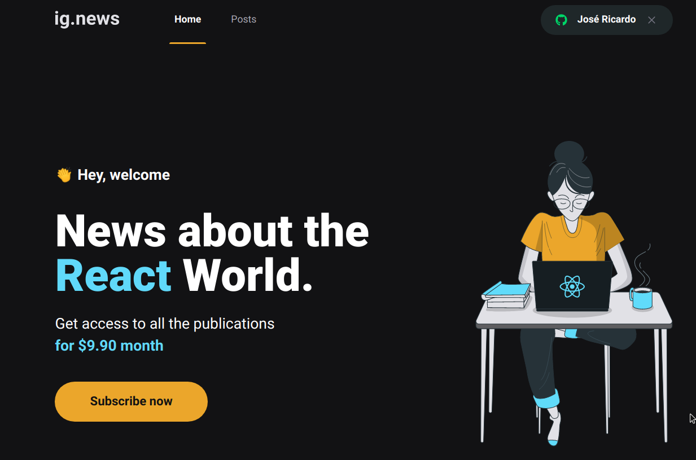
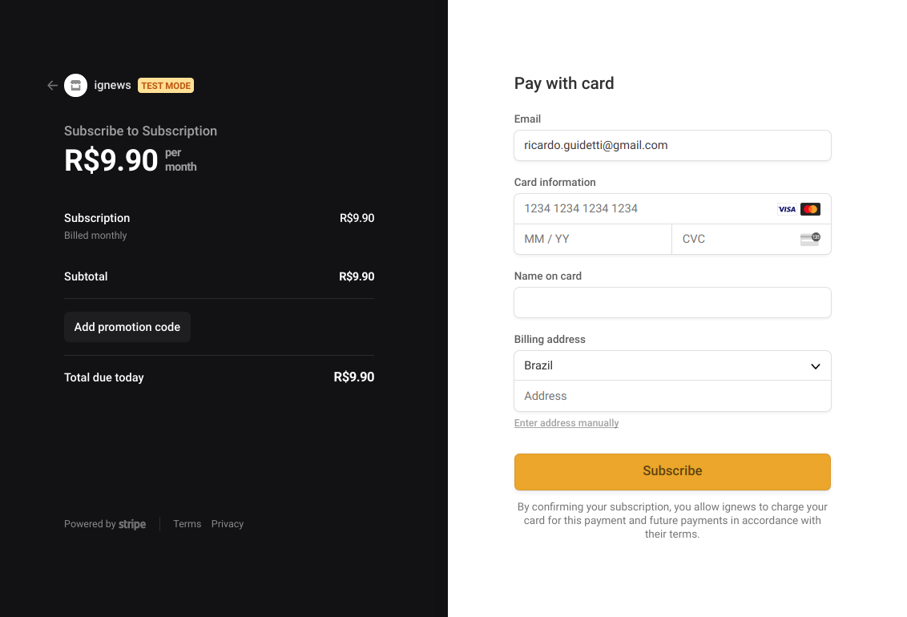

<h1 align="center">
    IgNews
</h1>

<h4 align="center">
   :books: Projeto de postagem com inscrição mensal, estilo medium
</h4>
 
<h4/>
<p align="center">
  
<p/>

<p align="center">
    
    <br/><br/>
    
<p/>

## :bulb: Instalação

Abaixe o projeto com 
```shell
git clone https://github.com/thelokys/ignews.git # HTTPS
ou
git clone git@github.com:thelokys/ignews.git # SSH
```
## :rocket: Executando projeto

Entre da pasta do projeto `cd ignews`

Utilize o [yarn](https://classic.yarnpkg.com/lang/en/) para iniciar o projeto. Dentro da pasta execute `yarn install` para baixar as dependências

### Variáveis de ambiente

Altere o nome do `.env.local.example` para `.env.local`

> adicione as variáveis ambiente de acordo com as suas credenciais

### Para iniciar a aplicação

Deixe um terminal para ouvir os eventos do webhook com o comando

- `stripe listen --forward-to localhost:3000/api/webhooks`

Execute a aplicação

- `yarn dev`

## :computer: Tecnologias
  
Tecnologias utilizada:
- [Framework - Nextjs](https://nodejs.org/en/)
- [The Headless - Prismic CMS](https://prismic.io/) 
- [The data API for modern applications - Fauna](https://fauna.com/)
- [Online payment processing for internet businesses - Stripe](https://stripe.com/en-br)
- [Authentication for Next.js](https://next-auth.js.org/)

---
